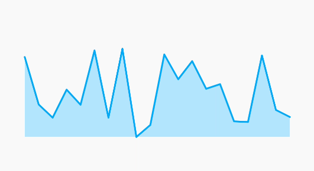
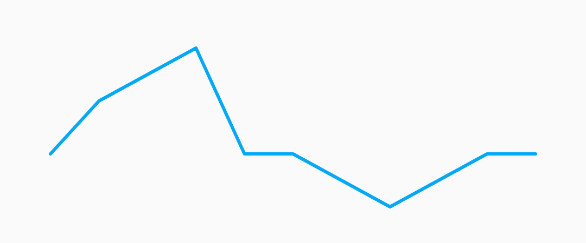
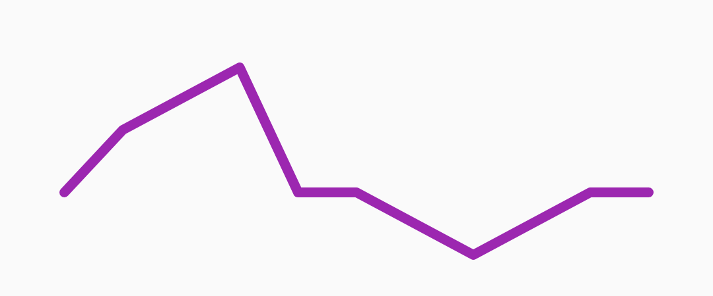
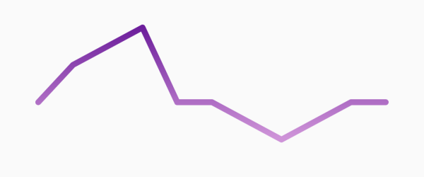
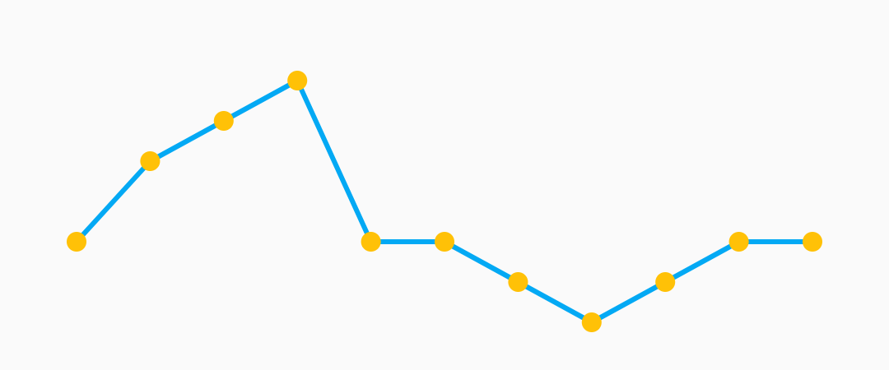
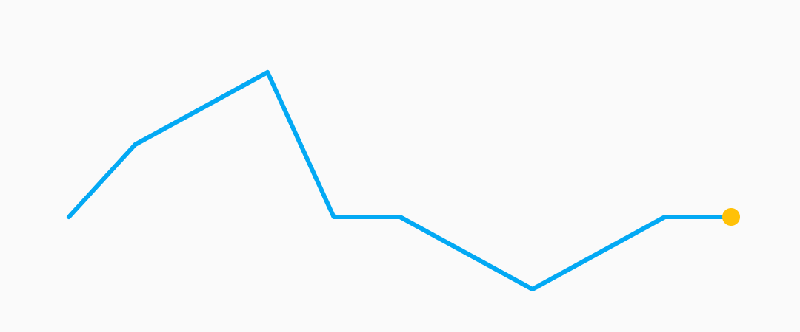
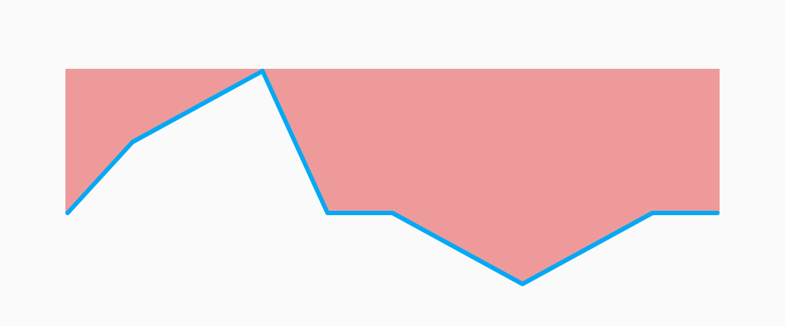
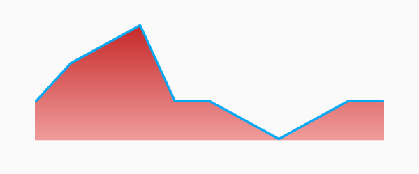
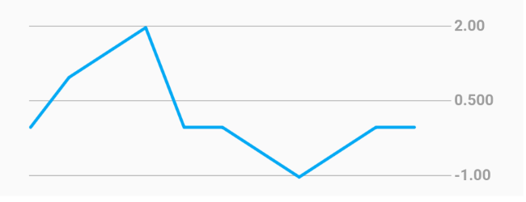

[](https://pub.dartlang.org/packages/flutter_sparkline)

# flutter_sparkline

Beautiful sparkline charts for Flutter.



## Installation

Install the latest version [from pub](https://pub.dartlang.org/packages/flutter_sparkline#-installing-tab-).

## Quick Start

Import the package, create a `Sparkline`, and pass it your data.

```dart
import 'package:flutter/material.dart';
import 'package:flutter_sparkline/flutter_sparkline.dart';

void main() {
  var data = [0.0, 1.0, 1.5, 2.0, 0.0, 0.0, -0.5, -1.0, -0.5, 0.0, 0.0];
  runApp(
    new MaterialApp(
      home: new Scaffold(
        body: new Center(
          child: new Container(
            width: 300.0,
            height: 100.0,
            child: new Sparkline(
              data: data,
            ),
          ),
        ),
      ),
    ),
  );
}
```




## Customization

### Sparkline

| Property     | Default          |
|--------------|:----------------:|
| lineWidth    | 2.0              |
| lineColor    | Colors.lightBlue |
| lineGradient | null             |

Example:

```dart
new Sparkline(
  data: data,
  lineWidth: 5.0,
  lineColor: Colors.purple,
);
```



```dart
new Sparkline(
  data: data,
  lineWidth: 10.0,
  lineGradient: new LinearGradient(
    begin: Alignment.topCenter,
    end: Alignment.bottomCenter,
    colors: [Colors.purple[800], Colors.purple[200]],
  ),
);
```



---

### Points

| Property   | Default               |
|------------|:---------------------:|
| pointsMode | PointsMode.none       |
| pointSize  | 4.0                   |
| pointColor | Colors.lightBlue[800] |

| PointsMode     | Description                               |
|:--------------:|-------------------------------------------|
| none (default) | Do not draw individual points.            |
| all            | Draw all the points in the data set.      |
| last           | Draw only the last point in the data set. |

Example:

```dart
new Sparkline(
  data: data,
  pointsMode: PointsMode.all,
  pointSize: 8.0,
  pointColor: Colors.amber,
);
```



```dart
new Sparkline(
  data: data,
  pointsMode: PointsMode.last,
  pointSize: 8.0,
  pointColor: Colors.amber,
);
```



---

### Fill

| Property     | Default               |
|--------------|:---------------------:|
| fillMode     | FillMode.none         |
| fillColor    | Colors.lightBlue[200] |
| fillGradient | null                  |

| FillMode       | Description                           |
|:--------------:|---------------------------------------|
| none (default) | Do not fill, draw only the sparkline. |
| above          | Fill the area above the sparkline.    |
| below          | Fill the area below the sparkline.    |

Example:

```dart
new Sparkline(
  data: data,
  fillMode: FillMode.below,
  fillColor: Colors.red[200],
);
```


```dart
new Sparkline(
  data: data,
  fillMode: FillMode.above,
  fillColor: Colors.red[200],
);
```



```dart
new Sparkline(
  data: data,
  fillMode: FillMode.below,
  fillGradient: new LinearGradient(
    begin: Alignment.topCenter,
    end: Alignment.bottomCenter,
    colors: [Colors.red[800], Colors.red[200]],
  ),
);
```



### Grid Lines

| Property               | Default               |
|------------------------|:---------------------:|
| enableGridLines        | false                 |
| gridLineColor          | Colors.grey           |
| gridLineLabelColor     | Colors.grey           |
| gridLinelabelPrefix    | ""                    |
| gridLineAmount         | 5                     |
| gridLineWidth          | 0.5                   |
| gridLineLabelPrecision | 3                     |

Example:

```dart
new Sparkline(
  data: data,
  enableGridLines: true,
  gridLineAmount: 3,
),
```



---

### Todo:

- [x] simple sparkline
- [x] custom line width
- [x] custom line color 
- [x] optional rounded corners
- [x] fill
- [x] embiggen individual points/change color
- [x] different points modes [all/last/none]
- [ ] animate between two sparklines
- [ ] animate drawing a single sparkline
- [ ] gesture detector to select closest point to tap
- [ ] baseline
- [x] different fill modes [above/below/none]
- [x] fix edge points overflowing by offsetting by lineWidth
- [ ] better corner rounding
- [ ] axis labels
- [x] gradient shader on line paint
- [x] gradient shader on fill paint
- [ ] multiple overlapping sparklines on a shared axis
- [ ] tests
